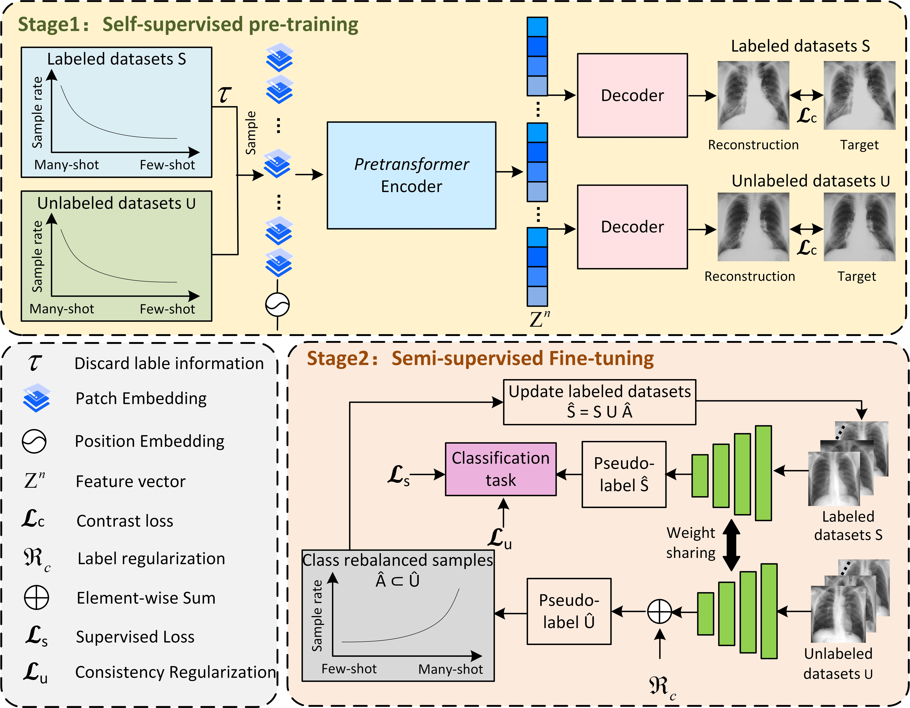

# Pre-TSCR model from tensorflow 2

Code for the paper: "Pre-TSCR: Pre-trained two-stage class rebalancing model for medical image classification"

## Model Overview

We introduce a pre-training fine-tuning strategy. The pre-training phase focuses on training the encoder to produce more precise representations from X-ray images, thereby harnessing the potential of unlabeled samples. The fine-tuning phase aims to achieve better performance on downstream medical image analysis tasks.The architecture of Pre-TSCR is illustrated below:

## Datasets

Download or generate the datasets as follows:

The NIH ChestX-ray14 public dataset can be found here: https://www.kaggle.com/datasets/nih-chest-xrays/data. The OpenI ChestX-ray public dataset can be found here: https://openi.nlm.nih.gov/faq#collection.

## Acknowledgments

This work was supported by the National Natural Science Foundation of China [grant numbers U21A20469]; the National Natural Science Foundation of China[grant numbers 62376183]; the National Natural Science Foundation of China [grant numbers 61972274]; the National Health Commission Key Laboratory of Pneumoconiosis open project [grant numbers YKFKT004]; the NHC Key Laboratory of Pneumoconiosis Shanxi China [grant numbers 2020-PT320-005]; the Shanxi Provincial Science and Technology Innovation Talent Team Special Plan [grant numbers 202304051001009].